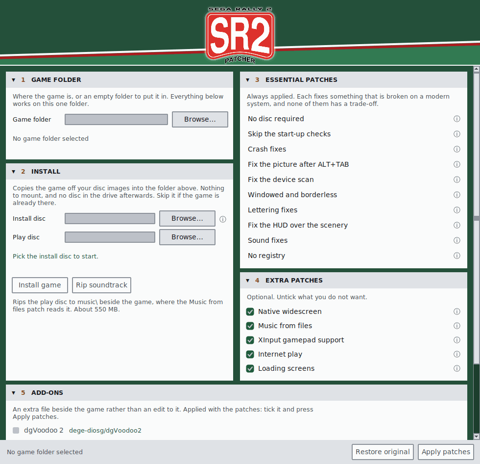

<p align="center">
  
</p>

# SR2 Patcher

Gets *SEGA RALLY 2* (PC, 1999) running properly on a modern system. It
installs the game straight from your disc images and fixes the crashes,
the invisible text and the dead controller. Then the extras: the picture
at your monitor's size and shape, the soundtrack from files, an XInput
pad with the controls rebindable in-game, and online play with a team
list and no port forwarding. Windows 10 and 11, Wine and Proton.

<p align="center">
  
</p>

**Work in progress.** The game plays start to finish on all three
releases, but this is a hobby project poking at a 27-year-old binary and
things will turn up. [Reporting a bug](#reporting-a-bug) says what helps.

<h4 align="center">
  <a href="#quick-start">Quick start</a> &nbsp;·&nbsp;
  <a href="#disc-images">Disc images</a> &nbsp;·&nbsp;
  <a href="#what-the-patches-do">Patches</a> &nbsp;·&nbsp;
  <a href="#widescreen">Widescreen</a> &nbsp;·&nbsp;
  <a href="#controls">Controls</a>
  <br /><br />
  <a href="#internet-play">Internet play</a> &nbsp;·&nbsp;
  <a href="#music">Music</a> &nbsp;·&nbsp;
  <a href="#builds">Builds</a> &nbsp;·&nbsp;
  <a href="#from-a-terminal">Terminal</a> &nbsp;·&nbsp;
  <a href="#reporting-a-bug">Bugs</a> &nbsp;·&nbsp;
  <a href="#known-issues">Known issues</a>
</h4>

## Quick start

There is no exe yet, so the patcher is one Python script with a window.

1. **Install Python** from [python.org](https://www.python.org/downloads/),
   3.8 or newer. On the installer's first page, tick **Add python.exe to
   PATH**. Tk, which draws the window, comes with it. On Linux, see
   [From a terminal](#from-a-terminal).
2. **Get the script.** Download
   [`sr2-patcher.py`](https://raw.githubusercontent.com/pairomaniac/sr2-patcher/main/sr2-patcher.py)
   (right-click, *Save link as*), or use *Code → Download ZIP* on this
   page. That one file is all you need.
3. **Run it.** Double-click `sr2-patcher.py`, or open a terminal in its
   folder and run `py sr2-patcher.py`.

The window is split into numbered sections. Work through them in order:

1. **GAME FOLDER** - where the game is, or an empty folder to put it
   in. Everything below works on this one folder. An install of your own
   has to be unmodified; if yours is refused, see [Builds](#builds).
2. **INSTALL** - put disc 1's `.cue` in **Install disc**, disc 2's in
   **Play disc**, and press **Install game**, then **Rip soundtrack**.
   Skip this card if the game is already in the folder above.
   See [Disc images](#disc-images) and [Music](#music).
3. **ESSENTIAL PATCHES** - always applied, no tick boxes.
4. **EXTRA PATCHES** - all ticked to start with, and yours to change.
   Click the ⓘ beside a patch to read what it does. Then press
   **Apply patches**.
5. **ADD-ONS** - on Windows **dgVoodoo 2** is ticked, and downloaded
   when you press Apply; see [Add-ons](#add-ons).

Then run `SEGA RALLY 2.exe` from that folder. **Restore original** puts
the game back if you change your mind.

## Disc images

The patcher reads the images itself. Nothing to mount, no virtual drive,
and no disc in the drive afterwards.

You need both discs: the game is on the first, the music on the second.

- **Install disc** - a `.cue` with its `.bin` beside it, an `.iso`, a
  folder you have already copied the disc to, or its `data1.cab`. The
  `.cue` is the small text file, not the `.bin`.
- **Play disc** - a `.cue` with its `.bin` files. An `.iso` will not do
  here: it drops the audio tracks, and those are the music.

The game takes about 800 MB and the soundtrack another 550 MB.

### If you have the discs, not images

Image them once:

- **Windows** - [ImgBurn](https://www.imgburn.com) in *Read* mode, with
  the output set to **BIN/CUE** rather than ISO.
- **Linux** - `cdrdao`, then its own `toc2cue`:

  ```bash
  cdrdao read-cd --driver generic-mmc-raw --datafile sr2-disc2.bin \
      sr2-disc2.toc /dev/sr0
  toc2cue sr2-disc2.toc sr2-disc2.cue
  ```

## What the patches do

**Essential** fixes what is broken on a modern system, has no trade-off,
and is always applied. **Extra** is down to taste: every one starts
ticked, and unticking one takes it back out on the next **Apply
patches**.

The offsets and internals of every patch are in
[docs/NOTES.md](docs/NOTES.md).

### Essential

- **No disc required** - the game's data read from the folder it is
  installed in, in place of the play disc it used to scan your drives
  for. Every mode is open with nothing in the drive.
- **Skip the start-up checks** - the four checks the game makes before it
  opens its window: the video card weighed against a 1999 list and 4 MB
  of video memory, a mode list that had to offer 640x480 at 16 bits, a
  desktop that had to be 16-bit itself, and on the Australian release a
  Windows version that had to be 98 or older.
- **Crash fixes** - three reads and frees past the end of something, each
  of which Windows ends the process for: the back buffer's Z-buffer on
  start-up, a texture released from outside the table's range on the logo
  screen, and a buffer freed that was not the replay gallery's own.
- **Fix the picture after ALT+TAB** - the game's surfaces, rebuilt as the
  window comes back to the front. A stock game carried on drawing to the
  ones the driver threw away while it was in the background.
- **Fix the device scan** - the device list, asked for through `dinput8`
  and filtered to keyboards, mice and controllers. A stock game went
  through the legacy `dinput` and read every HID device on the machine,
  which is where the white window on start came from: lit keyboards,
  composite pads, some wheels.
- **Windowed and borderless** - the game in a window, in place of taking
  over the display at 640x480. It starts borderless on the monitor it
  opens on, and **ALT+ENTER** gives a framed window to move, resize or
  maximise, and back.
- **Lettering fixes** - two screens' worth of text the game drew and the
  card did not show: the black lettering of the menu screens, which came
  out as hollow outlines, and the name you type, the team list and the
  chat in multiplayer, which did not appear at all.
- **Fix the HUD over the scenery** - the HUD drawn after the scene rather
  than in the middle of it. The tachometer's plate blanked the lake
  behind it on Mountain, and the ten-year championship's credits ran
  behind the replay's frame.
- **Sound fixes** - one curve behind all three volume sliders, with the
  two musics matched to it, so equal settings are equally loud. Each
  slider had a curve of its own, and the Australian release ran its
  effects at a fraction of the others' and wanted a mixer device before
  it would start at all.
- **No registry** - the game's settings as plain files beside the exe:
  `SR2.DSP` for the display, `SR2.CFG` for the controls. Nothing in the
  registry and nothing an installer has to write, so the folder can be
  copied as it is.

### Extra

- **Native widescreen** - the game renders at the size you pick, 640x480
  to 3840x2160, in place of 640x480 stretched. See
  [Widescreen](#widescreen).
- **Music from files** - the soundtrack as `music\track02.wav` onward
  beside the game, in place of the audio tracks on the play disc. See
  [Music](#music).
- **XInput gamepad support** - a modern pad wherever the game takes
  input, with every control rebindable from inside it. See
  [Controls](#controls).
- **Internet play** - the connection screen's own rows, INTERNET,
  DIRECT IP and LAN, in place of the DirectPlay the game shipped with.
  See [Internet play](#internet-play).
- **Loading screens** - the stage's card, its artwork and its name, held
  for three seconds. The course loads in well under one on a machine of
  today, so the card was gone before you had read it.

### Add-ons

An add-on is an extra file beside the game rather than an edit to it. It
is applied with the patches: tick it and press **Apply patches**.

**dgVoodoo 2** is [dege's](https://github.com/dege-diosg/dgVoodoo2)
DirectDraw on Direct3D 11. Windows' own DirectDraw refuses a picture over
2048 a side and has grown slow and erratic with this game on some
machines; this has neither problem. Apply downloads the latest release
and puts its `ddraw.dll` and config in `MUSASHI\` and `D3DImm.dll` beside
the exe, with fast video memory access on, the watermark off and
ALT+ENTER left to the game. It is ticked by default on Windows and off
under Wine and Proton, which have wined3d and no such limit. Untick it
and Apply to take it out again, the config kept; **Restore original**
takes the config as well.

### Diagnostics

The collapsed **DIAGNOSTICS** section adds logging patches for a bug
report - frame pacing, the Direct3D bring-up, the draws and the volume
calls. They are off unless asked for and none of them changes how the
game plays. What each one writes is in
[docs/DEVELOPING.md](docs/DEVELOPING.md).

## Widescreen

**Options → Graphic Settings** gains an **Aspect Ratio** row - 4:3,
16:10, 16:9, 21:9, 32:9 - and its **Resolution** row lists that aspect's
sizes, 640x480 to 3840x2160 and 5120x1440. The picture takes the new size
at the next screen change.

On a wide screen the race shows more at the sides rather than stretching
the middle. The menus and HUD keep their shape in the middle, with the
tiled backgrounds carried out to the edges; the picture screens - the
title, the mode select - stay 4:3 with the picture itself stretched,
blurred and dimmed behind them to fill the sides; the loading, game-over
and logo screens get that background.

On Windows the list stops at 2048 a side without the dgVoodoo 2 add-on -
see [Known issues](#known-issues).

## Controls

An XInput pad works as it is: stick to steer, triggers for the pedals,
Start to pause. In the menus the D-pad or stick moves, A and Start
choose, and B goes back; in the multiplayer team room Back switches
between the slot list and the MENU row, as TAB does.

**Options → Device Settings** is a new page showing both players'
controls, keyboard and pad side by side. Press a key or a button to
rebind any of them. The controls are saved as plain text in `SR2.CFG`
next to the game.

## Internet play

The connection screen offers three rows in place of IPX, TCP/IP, modem
and serial:

- **INTERNET** - **SHOW TEAMS** lists the teams open anywhere. Joining
  needs no port forwarding.
- **DIRECT IP** - type the host's address, or `host:port`. The host
  forwards UDP 47626.
- **LAN** - searches the local network.

The team room, the chat, the car and course selection and the race are
the game's own. Up to four players, and everyone needs the same patcher
version. If something goes wrong online, `sr2-net.log` from each machine
is the report to send - create the empty file beside the exe first. How
it works is in [docs/NETWORK.md](docs/NETWORK.md).

## Music

The soundtrack was thirteen audio tracks on the play disc, which is why a
stock install is silent without it in the drive. **Rip soundtrack** in
the window writes them to `music\track02.wav` onward beside the game,
about 550 MB, and the **Music from files** patch plays them from there.

Or from a terminal:

```bash
python3 sr2-patcher.py --rip "Sega Rally 2 (Disc 2).cue" ~/games/sr2
```

Any pressing's disc 2 will do: stripped of digital silence the three are
the same recording.

## Builds

The patcher knows the European, American and Australian releases, tells
them apart by itself, and installs and patches the Pentium III build of
each - the one the original installer chose on any CPU of the last
twenty-five years.

| Release | `SEGA RALLY 2.exe` | MD5 |
| --- | --- | --- |
| European | 1,469,952 | `51b3da97c3c73611d3516b65bb684cb5` |
| American | 1,472,000 | `90d1f25110781707a888475ca37e9240` |
| Australian | 1,754,624 | `84c95aed1b8cd8402fcff98f1687df7b` |

The Japanese releases are not known: no verified dump of one has been
seen, and one would be welcome.

Before it writes anything the patcher checks all fourteen files of that
build by size and checksum - the ten it patches and the four other files
the Pentium III set replaced. If one does not match you get a line naming
it and nothing is touched. That means a modified game, a previous
patcher's work or a mixed install; the fix is to install afresh from the
disc.

Each patched file gets a `.bak` beside it, the untouched original. Apply
starts from those every time, so patching twice is the same as patching
once, and **Restore original** is putting them back.

## From a terminal

Everything the window does, without the window:

```bash
python3 sr2-patcher.py --install "Sega Rally 2 (Disc 1).cue" ~/games/sr2 English
python3 sr2-patcher.py --rip "Sega Rally 2 (Disc 2).cue" ~/games/sr2
python3 sr2-patcher.py --patch ~/games/sr2
python3 sr2-patcher.py --restore ~/games/sr2
```

`--patch` applies every patch unless you name some: by name to apply only
those (the names are listed at the top of `sr2-patcher.py`), or with a
leading minus to leave them out, as in `--patch ~/games/sr2 -music`.
Leaving a patch out also leaves out whatever needs it. The `dgvoodoo`
add-on is on by default on Windows; `-dgvoodoo` leaves it out, and naming
it puts it in elsewhere.

On Linux the terminal commands need nothing extra; the window needs Tk:

```bash
sudo apt install python3-tk        # Debian, Ubuntu, Mint
sudo dnf install python3-tkinter   # Fedora
sudo pacman -S tk                  # Arch
```

Under Wine or Proton the patched folder runs as it is. The manifests
beside the exe stand in for the COM registration the installer used to
do, and the game is declared DPI-aware, so Windows neither scales its
window nor puts up the compatibility-assistant box about it.

## Reporting a bug

Open an [issue](https://github.com/pairomaniac/sr2-patcher/issues). Say
which release you have (European, American, Australian) - the window
names it - whether you are on Windows or Wine/Proton, and what you were
doing just before. For a crash on Windows, the entry under Event Viewer →
Windows Logs → Application names the faulting module and offset, which is
usually enough to find it. For a disc image of a release the patcher does
not know, or anything that does not fit an issue: pairo@segaonline.net.

## Known issues

- **The replay's keys have no pad equivalent.** Enter hides and shows the
  overlay; Up and Down cycle the camera (live, around, driver, side);
  Left and Right move it (around orbits, driver goes to third person,
  side switches sides); Page Up and Page Down change the field of view in
  the around view. Reported by
  [@chmcl95](https://github.com/chmcl95).
- **The alternative colours have no pad equivalent.** Page Up held while
  choosing the Stratos, Corolla, Impreza, Lancer Evo VI or ST185 picks
  the car's other colour. Reported by
  [@chmcl95](https://github.com/chmcl95).
- **Windows: sizes over 2048 a side need the dgVoodoo 2 add-on.**
  Windows' own Direct3D refuses a picture wider or taller than 2048 as a
  drawing target ("Failed to initialize. Error code 80004005"), on NVIDIA
  and AMD alike. With the add-on the full list is written, 640x480 to
  3840x2160 and 5120x1440. Without it the list stops at 1920x1200, with
  the halves of the 21:9 and 32:9 sizes (1280x540, 1720x720, 1920x540)
  for those screens, and the picture is stretched to the window. Wine and
  Proton have no such limit.
- **Windows: error 80004005 at start.** One cause is fixed. If it still
  happens, tick **Direct3D bring-up** under DIAGNOSTICS, Apply, start the
  game, and send `logs\d3dinit.log` with the card and driver.

## Planned

In no particular order:

- **A Windows exe** of the patcher, so Python is not needed - built on
  GitHub from this repository, as v-on-patcher's is.
- **The Japanese releases** - once a verified dump turns up. The European
  exe is Sega's UPDATE250 exe byte for byte, so the 2.50-patched original
  is probably a small row; the unpatched original and the two rereleases
  are unknown builds.

## Working on the patcher

[docs/](docs/README.md) covers how the game works and how the patches are
made; `tools/check.py` runs every check.

## AI disclaimer

LLMs are part of the toolchain, alongside pefile, capstone, unshield,
Unicorn, Wine's tracing and WinDbg on the running game. Scope, testing and
debugging are human: every change is read before it goes in and played
before it ships. Offsets are verified against the originals before
anything is written, and the patcher refuses any file that is not an
unmodified build it has tables for.

## Credits and licence

Successor to [v-on-patcher](https://github.com/pairomaniac/v-on-patcher).
The logo and icon are the work of SirRockEmSockEm. The game is SEGA's.
`LICENSE` (MIT) covers the patcher, its tools and its documentation, not
the game or the bytes quoted from it.
