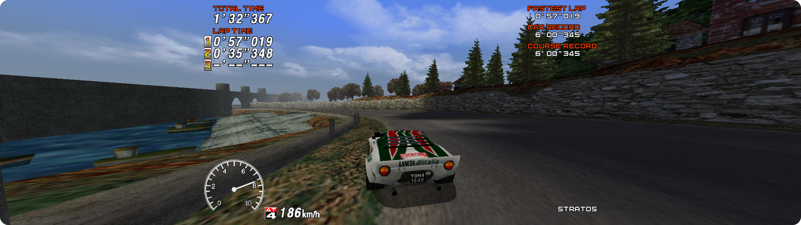
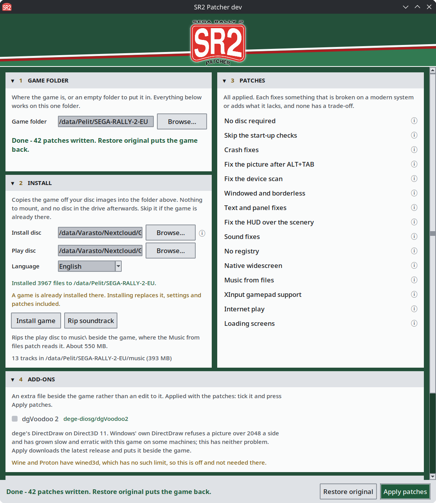
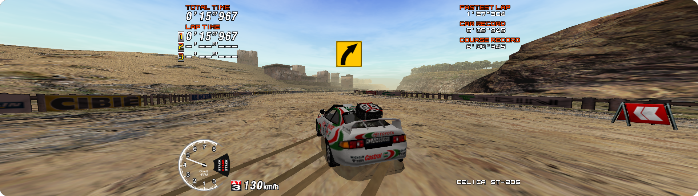
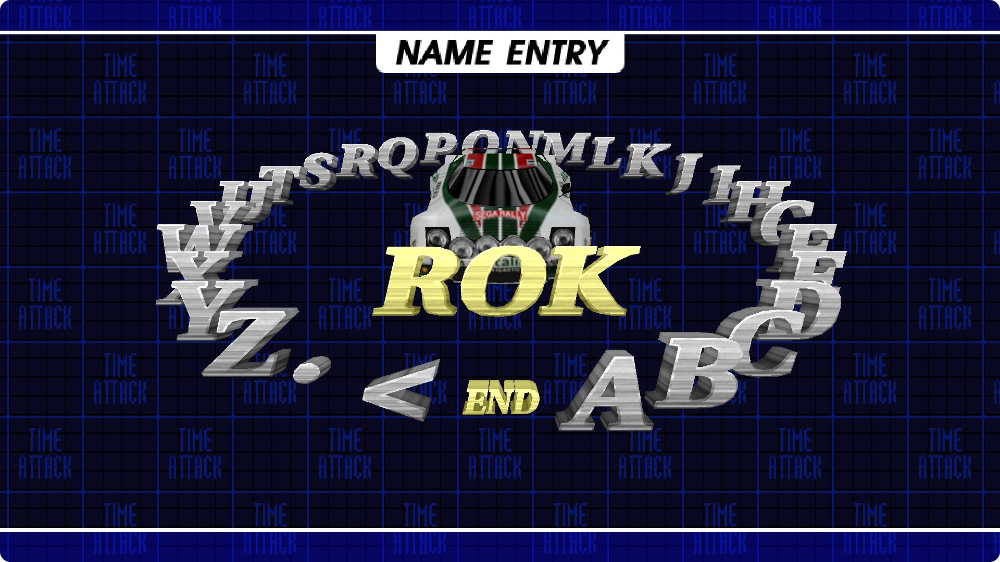
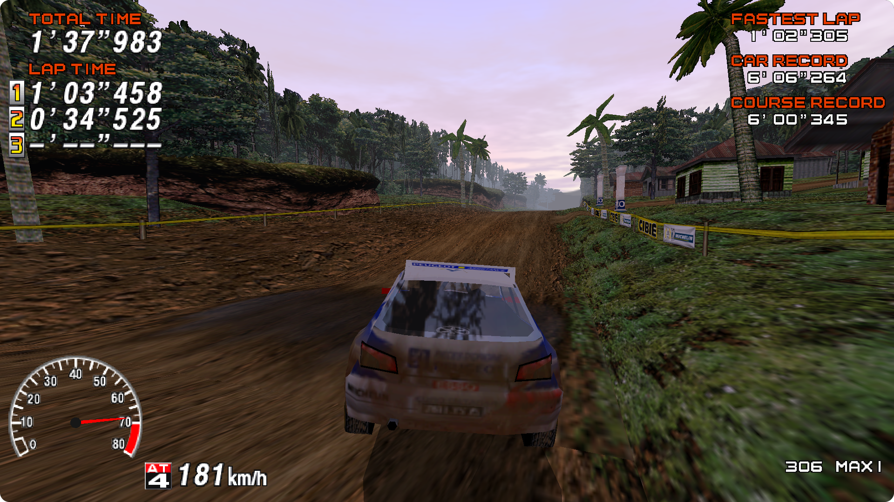
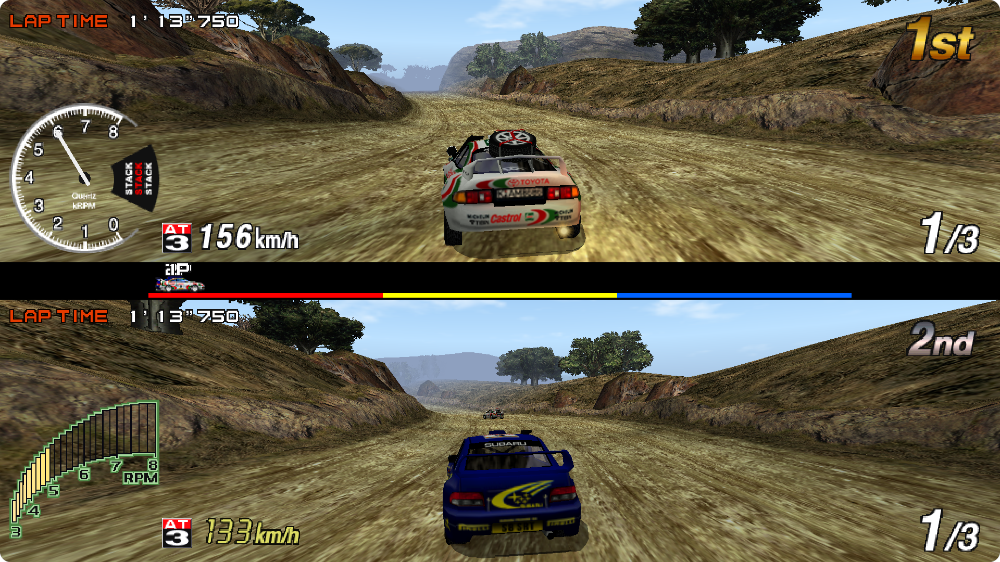
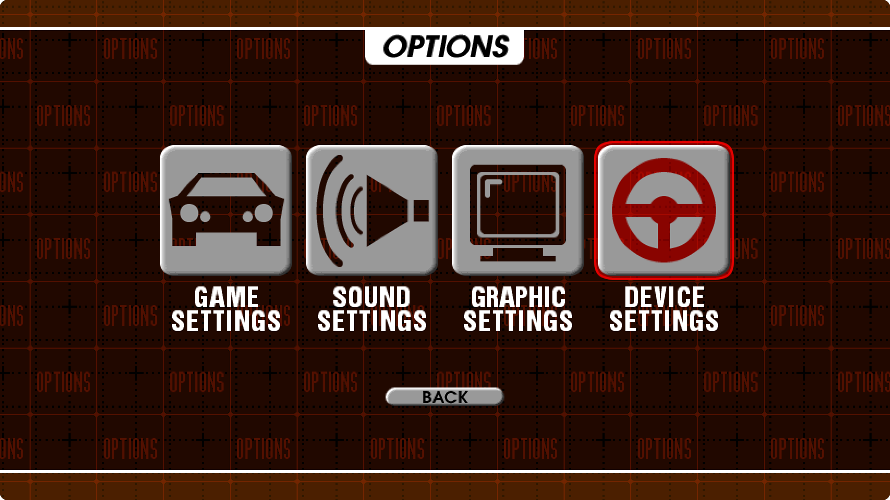
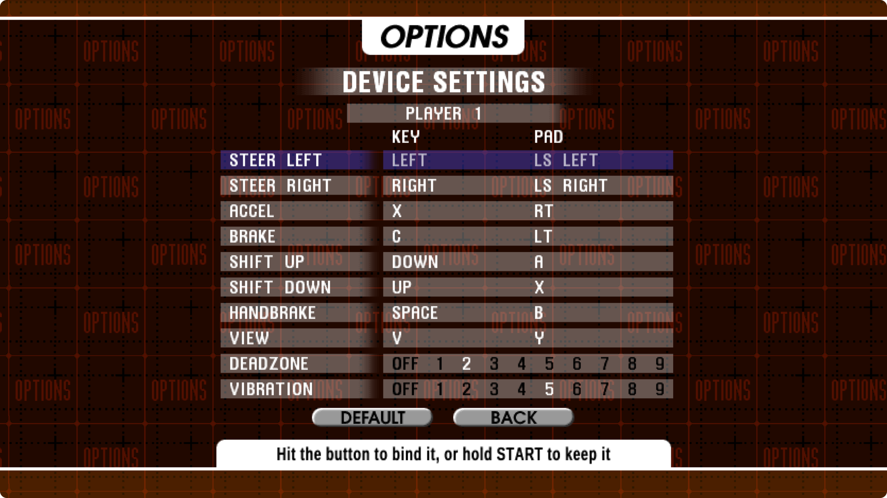
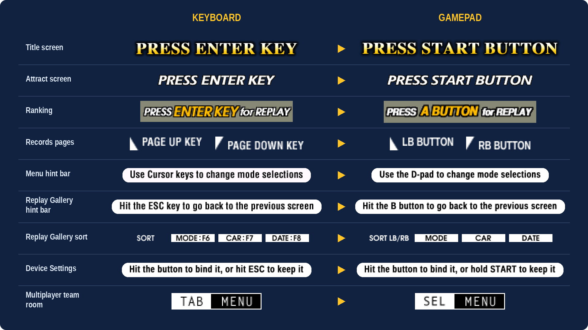
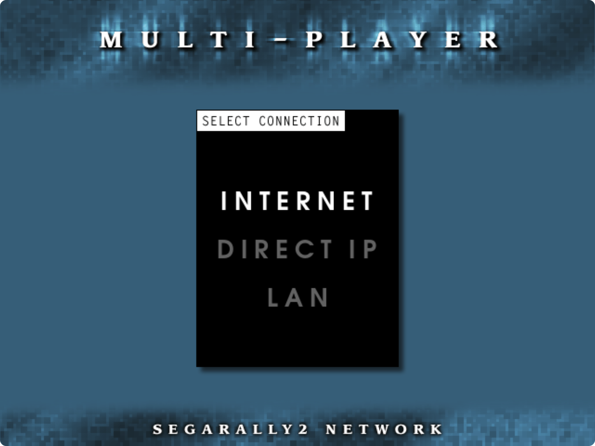

<p align="center">
  
</p>

# SR2 Patcher

Gets *SEGA RALLY 2* (PC, 1999) running properly on a modern system.
Install it from your disc images, press a button, and it plays: no
crashes, no invisible text, no dead controller, no disc in the drive.

You also get the picture at your monitor's size and shape, the soundtrack
from files, an XInput pad you can rebind in-game, and online play with no
port forwarding. Windows 10 and 11, Wine and Proton.



**Work in progress.** The game plays start to finish on all four
releases, but this is a hobby project poking at a 27-year-old binary and
things will turn up. [Reporting a bug](#reporting-a-bug) says what helps.

<h4 align="center">
  <a href="#quick-start">Quick start</a> &nbsp;·&nbsp;
  <a href="#virus-warnings">Virus warnings</a> &nbsp;·&nbsp;
  <a href="#disc-images">Disc images</a> &nbsp;·&nbsp;
  <a href="#what-the-patches-do">Patches</a> &nbsp;·&nbsp;
  <a href="#widescreen">Widescreen</a> &nbsp;·&nbsp;
  <a href="#controls">Controls</a>
  <br /><br />
  <a href="#internet-play">Internet play</a> &nbsp;·&nbsp;
  <a href="#music">Music</a> &nbsp;·&nbsp;
  <a href="#builds">Builds</a> &nbsp;·&nbsp;
  <a href="#from-a-terminal">Terminal</a> &nbsp;·&nbsp;
  <a href="#reporting-a-bug">Bugs</a> &nbsp;·&nbsp;
  <a href="#known-issues">Known issues</a>
</h4>

## Quick start

**Download** `sr2-patcher-*-win.zip` from the
[latest release](https://github.com/pairomaniac/sr2-patcher/releases/latest),
unzip it anywhere and run `sr2-patcher.exe`; the `_internal` folder
beside it has to stay. If SmartScreen or a virus scanner objects, see
[Virus warnings](#virus-warnings).

On Linux, or on Windows without the exe, take `-python.zip` from the same
page:

1. **Install Python** 3.8 or newer from
   [python.org](https://www.python.org/downloads/), ticking **Add
   python.exe to PATH** on the installer's first page. On Linux, see
   [From a terminal](#from-a-terminal).
2. **Unzip it** somewhere of its own; `MGNetWk.dll` has to stay in the
   `net` folder beside the script.
3. **Run it.** Double-click `sr2-patcher.py`, or `py sr2-patcher.py` from
   a terminal in its folder.

If the script on Windows cannot download dgVoodoo 2
(`CERTIFICATE_VERIFY_FAILED`), run `py -m pip install certifi` once.

<p align="center">
  
</p>

Work through the numbered sections in order:

1. **GAME FOLDER** - where the game is, or an empty folder to put it in.
   An install of your own has to be unmodified; if yours is refused, see
   [Builds](#builds).
2. **INSTALL** - disc 1's `.cue` in **Install disc**, disc 2's in **Play
   disc**, then **Install game** and **Rip soundtrack**. Skip it if the
   game is already in the folder. See [Disc images](#disc-images) and
   [Music](#music).
3. **PATCHES** - all applied; the ⓘ beside each says what it does.
   Press **Apply patches**.
4. **ADD-ONS** - on Windows **dgVoodoo 2** is ticked and downloaded on
   Apply. See [Add-ons](#add-ons).

Then run `SEGA RALLY 2.exe` from that folder. **Restore original** puts
the game back.

## Virus warnings

The exe is signed with a Certum open-source code signing certificate
(Properties → Digital Signatures). SmartScreen can still warn until it
has built up a reputation: **More info** → **Run anyway**.

Scanners can still flag it, since a program that edits other programs is
what they look for. A detection ending in `!ml`, such as Defender's
`Trojan:Win32/Wacatac.B!ml`, is a machine-learning guess, not a match
for anything known. To allow it in Defender: Windows Security → Virus &
threat protection → Protection history → the entry → **Allow**.

Every release is built on GitHub from this repository.

## Disc images

The patcher reads the images itself: nothing to mount, no virtual drive.
You need both discs: the game is on the first, the music on the second.

- **Install disc** - a `.cue` with its `.bin` beside it, an `.iso`, a
  folder you have already copied the disc to, or its `data1.cab`. The
  `.cue` is the small text file, not the `.bin`.
- **Play disc** - a `.cue` with its `.bin` files. An `.iso` will not do
  here: it drops the audio tracks, and those are the music.

The game takes about 550 MB and the soundtrack about as much again.

### If you have the discs, not images

Image them once:

- **Windows** - [ImgBurn](https://www.imgburn.com) in *Read* mode, with
  the output set to **BIN/CUE** rather than ISO.
- **Linux** - `cdrdao`, then its own `toc2cue`:

  ```bash
  cdrdao read-cd --driver generic-mmc-raw --datafile sr2-disc2.bin \
      sr2-disc2.toc /dev/sr0
  toc2cue sr2-disc2.toc sr2-disc2.cue
  ```

## What the patches do

Every patch is applied; none has a trade-off - widescreen stays 4:3
until you pick a size, the gamepad patch keeps the keyboard. To leave one
out, use the [terminal](#from-a-terminal). What each changes, down to
the byte, is in [docs/NOTES.md](docs/NOTES.md).

- **No disc required** - every mode plays with nothing in the drive.
- **Skip the start-up checks** - a 1999 video card, a 640x480 16-bit
  display mode, a 16-bit desktop and, on the Australian release, Windows
  9x. Nothing today passes them.
- **Crash fixes** - on start-up, on the logo screen, and on the way out
  of the replay gallery.
- **Fix the picture after ALT+TAB** - it comes back instead of staying
  black.
- **Fix the device scan** - the white window on start, from the game
  reading every USB device on the machine.
- **Windowed and borderless** - **ALT+ENTER** switches, on whichever
  monitor the window is on. Stock it took the whole screen at 640x480.
- **Text and panel fixes** - the menu text, the name you type, the team
  list and the chat were all invisible, and the team room's panels came
  out black with dgVoodoo 2.
- **Fix the HUD over the scenery** - the tachometer no longer blanks the
  lake behind it on Mountain.
- **Sound fixes** - the three volume sliders now match each other, and
  start at 6 rather than full.
- **No registry** - settings sit beside the game, so the folder can be
  copied anywhere.
- **Native widescreen** - the game renders at your screen's size and
  shape instead of 640x480 stretched. See [Widescreen](#widescreen).
- **Music from files** - the soundtrack plays from the folder instead of
  the disc. See [Music](#music).
- **XInput gamepad support** - a modern pad works everywhere, the
  driving and menu controls rebindable in-game. See [Controls](#controls).
- **Internet play** - online, direct IP and LAN in place of DirectPlay;
  no port forwarding needed. See [Internet play](#internet-play).
- **Loading screens** - the stage card is held for three seconds;
  today's machines load it faster than you can read it.

### Add-ons

An add-on is an extra file beside the game rather than an edit to it,
downloaded when you press **Apply patches**.

**dgVoodoo 2** is [dege's](https://github.com/dege-diosg/dgVoodoo2)
DirectDraw on Direct3D 11. Windows' own DirectDraw stops at 2048 a side
and is slow and erratic with this game on some machines. On by default
on Windows, off under Wine and Proton, which do not need it. Untick it
and Apply to take it out.

### Diagnostics

The collapsed **DIAGNOSTICS** section adds logging for a bug report, all
off by default; see [Reporting a bug](#reporting-a-bug).

## Widescreen



<p align="center">
  
  
</p>

**Options → Graphic Settings** gains an **Aspect Ratio** row - 4:3,
16:10, 16:9, 21:9, 32:9 - and a **Resolution** row listing that shape's
sizes, up to 5120x2880 at 16:9, 3840x2400 at 16:10, 5120x2160 at 21:9
and 7680x2160 at 32:9. The picture changes at the next screen.

A wide screen shows more at the sides rather than stretching the middle.
The menus and the HUD keep their shape in the centre; the title and mode
select stay 4:3, with the picture blurred behind them to fill the sides.

Two-player split screen follows the same size:



On Windows the list stops at 2048 a side without the
[dgVoodoo 2](#add-ons) add-on.

## Controls

An XInput pad works as it is: stick to steer, triggers for the pedals,
Start to pause, and in the menus A to choose and B to go back. The
driving and menu controls can be rebound for both players, keyboard and
pad, under **Options → Device Settings**.

<p align="center">
  
</p>

The less obvious ones:

| Where | What | Pad | Keyboard (2P) |
| --- | --- | --- | --- |
| Car select | The other colour of the Stratos, Corolla, Impreza, Lancer Evo VI or ST185 | Hold LB while choosing | Hold Page Up while choosing |
| Name entry | Erase the last letter | X | Backspace |
| Name entry | Jump to END | Start | - |
| Replay | Next / previous camera | RB / LB | Up / Down (S / X) |
| Replay | Turn the revolving camera; driver's or rear view; the side camera's side | Left stick | Left / Right (Z / C) |
| Replay | Zoom the revolving camera | RT / LT | Page Up / Page Down |
| Replay | Meter on / off | Y | Insert / Delete (T / G) |
| Replay | Switch the screen (2 PLAYER BATTLE, the winner) or the car watched (multiplayer) | X | TAB |
| Replay | Pause | Start | Enter (Space) |

The settings are saved as plain text in `SR2.CFG` beside the game;
delete the file for the defaults.

<p align="center">
  
  
</p>

## Internet play

<p align="center">
  
</p>

> [!IMPORTANT]
> Everyone in a team needs patcher **0.8.0 or later**. Older builds cannot
> join or be joined: update to play.

The connection screen offers three rows in place of IPX, TCP/IP, modem
and serial:

- **INTERNET** - every open team, listed as the screen opens; **SEARCH**
  asks again. No port forwarding on either side.
- **DIRECT IP** - **CREATE** hosts on UDP 47626, which the host forwards;
  the team room's status line shows the host's local and public address.
  **SEARCH** asks for the host's address, or `address:port`, and lists
  the team.
- **LAN** - the local network, searched as the screen opens.

The team room, the chat, the car and course selection and the race are
the game's own. Up to four players. After START the room says the race
is starting while the players are gathered, which can take a few
seconds. How it works is in [docs/NETWORK.md](docs/NETWORK.md).

## Music

The soundtrack is thirteen audio tracks on the play disc, which is why
a stock install is silent without it in the drive. **Rip soundtrack**
copies them into a `music` folder beside the game (about 550 MB) and
the **Music from files** patch plays them from there.

Or from a terminal:

```bash
python3 sr2-patcher.py --rip "Sega Rally 2 (Disc 2).cue" ~/games/sr2
```

Any pressing's disc 2 will do: they all carry the same recording.

## Builds

The patcher knows the European, American and Australian releases and
the Japanese reissue, tells them apart by itself, and installs and
patches the Pentium III build of each - the one the original installer
picks on any modern CPU.

| Release | `SEGA RALLY 2.exe` | MD5 | Redump |
| --- | --- | --- | --- |
| European | 1,469,952 | `51b3da97c3c73611d3516b65bb684cb5` | EI-1183-1 |
| American | 1,472,000 | `90d1f25110781707a888475ca37e9240` | 40924-0919 |
| Australian / Japanese (Sega) | 1,754,624 | `84c95aed1b8cd8402fcff98f1687df7b` | MK-85078-40 |
| Japanese (DigiCube, MediaKite) | 1,469,952 | `5c0242443ea289d3d461b15eddb63388` | DWRPD-00081 |

Sega's own 1999 Japanese disc (HCJ-0145) carries the same contents as
the Australian one, so that row covers both; the Japanese row covers
DigiCube's and MediaKite's reissues, whose discs are also the same.

Before writing anything the patcher checks every file it knows by size
and checksum. If one does not match, nothing is touched and a line names
it - usually a modified or half-patched install; install afresh from the
disc.

Each patched file gets a `.bak` beside it. Apply starts from those every
time, so patching twice is the same as patching once, and **Restore
original** puts them back.

## From a terminal

Everything the window does, without the window:

```bash
python3 sr2-patcher.py --install "Sega Rally 2 (Disc 1).cue" ~/games/sr2 English
python3 sr2-patcher.py --rip "Sega Rally 2 (Disc 2).cue" ~/games/sr2
python3 sr2-patcher.py --patch ~/games/sr2
python3 sr2-patcher.py --restore ~/games/sr2
```

`--patch` applies every patch unless you name some (the table in
`docs/NOTES.md` has the names); a leading minus leaves one out, as in
`--patch ~/games/sr2 -music`, along with whatever needs it. The
`dgvoodoo` add-on follows the same rule and is on by default on Windows.
`--patch ~/games/sr2 logs` turns on every diagnostic for a bug report;
a plain `--patch` turns them off again, all but the network log, which
stays until `-netlog`.

On Linux the terminal commands need nothing extra; the window needs Tk:

```bash
sudo apt install python3-tk        # Debian, Ubuntu, Mint
sudo dnf install python3-tkinter   # Fedora
sudo pacman -S tk                  # Arch
```

Under Wine or Proton the patched folder runs as it is.

## Reporting a bug

Open an [issue](https://github.com/pairomaniac/sr2-patcher/issues) with
the release (the window names it), Windows or Wine/Proton, and what you
were doing just before.

The game can log what it is doing, and most bugs need that to be found.
Under **DIAGNOSTICS** in the patcher, tick the boxes you are asked for
and press **Apply patches**; or turn them all on from a terminal with
`--patch <game folder> logs`. Reproduce the bug, then attach the `logs`
folder from beside `SEGA RALLY 2.exe`. For anything online, tick
**Network log** on every machine and send each one's folder. A plain
**Apply patches** turns the logging off again; the network log stays
until its box is unticked.

For a disc image of a release the patcher does not know, or anything
that does not fit an issue: pairo@segaonline.net.

## Known issues

The first three are rare and hard to reproduce; a report of what led up
to one helps.

- **Linux: half of the team room black.** Under Wine or Proton, usually
  after an ALT+TAB, the multiplayer team room can come back with half
  the screen black or garbled.
- **The tachometer needle during the countdown.** Now and then the
  needle is drawn off its pivot for the start countdown, and is right
  again once the race is under way.
- **Stuck leaving the Network menu.** Backing out of the Network menu
  the moment it opens can leave the game in the transition: not
  crashed, but not going anywhere. Give the menu a second before
  leaving it.

## Planned

In no particular order:

- **Controller rumble** - which the Dreamcast version does have.
- **Fleshing out the online functionality** - this one's a long term goal,
  but something I am interested in.

## Working on the patcher

[docs/](docs/README.md) covers how the game works and how the patches
are made; `tools/check.py` runs every check. The Windows build is
`tools/bundle.py` and `launcher/`, run by
[.github/workflows/build.yml](.github/workflows/build.yml).

## AI disclaimer

LLMs are part of the toolchain here: much of the assembly and the
documentation was written with one. The reverse engineering was not. The
addresses and the behaviour each patch relies on come from tracing and
debugging the running game with pefile, capstone, unshield, Unicorn,
Wine's debug channels and WinDbg, and the LLM writes to that brief. The
scope, the disc dumps, the testing and the debugging are human. The
patcher edits the game's own files and adds its code beside them; it is
not a reimplementation of the game.

Every change is read line by line before it goes in, and every patch is
played on all four builds before it ships. Offsets and bytes are verified
against the originals before anything is written, and the patcher refuses
any file that is not an unmodified build it has tables for.

## Credits and licence

Successor to
[v-on-patcher](https://github.com/pairomaniac/v-on-patcher). The logo
and icon are the work of SirRockEmSockEm. The DigiCube and MediaKite
support is by [chmcl95](https://github.com/chmcl95). The game is SEGA's.
`LICENSE` (MIT) covers the patcher, its tools and its documentation, not
the game or the bytes quoted from it.
